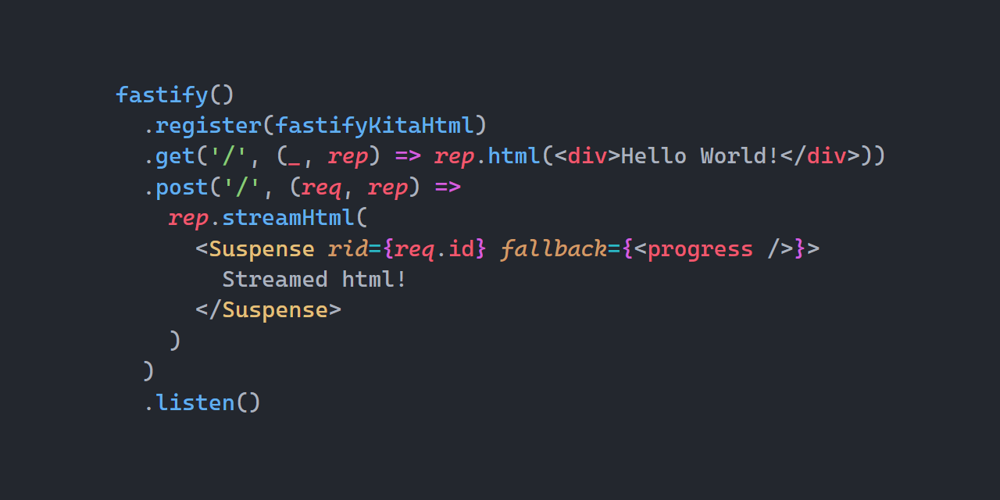

<p align="center">
   <b>Using this package?</b> Please consider <a href="https://github.com/sponsors/arthurfiorette" target="_blank">donating</a> to support my open source work ❤️
  <br />
  <sup>
   Help @kitajs/fastify-html-plugin grow! Star and share this amazing repository with your friends and co-workers!
  </sup>
</p>

<br />

<p align="center" >
  <a href="https://kita.js.org" target="_blank" rel="noopener noreferrer">
    
  </a>
</p>

<br />

<div align="center">
  <a title="MIT license" target="_blank" href="https://github.com/kitajs/fastify-html-plugin/blob/master/LICENSE"></a>
  <a title="NPM Package" target="_blank" href="https://www.npmjs.com/package/@kitajs/fastify-html-plugin"></a>
  <a title="Bundle size" target="_blank" href="https://bundlephobia.com/package/@kitajs/fastify-html-plugin@latest"></a>
  <a title="Last Commit" target="_blank" href="https://github.com/kitajs/fastify-html-plugin/commits/master"></a>
  <a href="https://github.com/kitajs/fastify-html-plugin/stargazers"></a>
</div>

<br />
<br />

<h1>🖨️ Fastify KitaJS Html Plugin</h1>

<p align="center">
  <code>@kitajs/fastify-html-plugin</code> is a fastify plugin to seamlessly integrate the KitaJS Html JSX engine into your fastify application.
  <br />
  <br />
</p>

<br />

- [Installing](#installing)
- [Preview](#preview)
- [Installing](#installing-1)
- [Configuration](#configuration)
- [Documentation](#documentation)
- [API](#api)
  - [`reply.html()`](#replyhtml)
  - [`reply.streamHtml()`](#replystreamhtml)
  - [`reply.setupHtmlStream()`](#replysetuphtmlstream)
- [License](#license)

<br />
<br />

## Installing

```sh
npm install @kitajs/fastify-html-plugin
```

<br />

## Preview



<br />

## Installing

> [!CAUTION]  
> You **must have followed the `@kitajs/html`'s [Installing](https://github.com/kitajs/html#installing) guide** before
> continuing, otherwise you will be vulnerable to XSS attacks.

```ts
import fastify from 'fastify';
import kitaHtmlPlugin from '@kitajs/fastify-html-plugin';

const app = fastify();

app.register(kitaHtmlPlugin);
```

## Configuration

Every option is well documented through their respective JSDoc comments, below are the default options.

| Name          | Description                                                                                       | Default                     |
| ------------- | ------------------------------------------------------------------------------------------------- | --------------------------- |
| `contentType` | The value of the `Content-Type` header.                                                           | `'text/html; charset=utf8'` |
| `autoDetect`  | Whether to automatically detect HTML content and set the content-type when `.html()` is not used. | `true`                      |
| `autoDoctype` | Whether to automatically add `<!doctype html>` to a response starting with <html>, if not found.  | `true`                      |
| `isHtml`      | The function used to detect if a string is a html or not when `autoDetect` is enabled.            | [isHtml](./lib/is-html.js)  |

<br />

## Documentation

`@kitajs/html` is a `JSX` -> `string` runtime, this package seamlessly integrates with `fastify` to improve the developer experience while also providing faster implementations for this use case.

- Read [`@kitajs/html` documentation](https://github.com/kitajs/html) for help with templating, and all other stuff related to `<jsx />`.
- Read [`@kitajs/ts-html-plugin` documentation.](https://github.com/kitajs/ts-html-plugin) for help setting up the **XSS** detector and IDE intellisense.

<br />

## API

### `reply.html()`

**Synchronously** waits for the component tree to resolve and sends it at
once to the browser.

This method does not support the usage of `<Suspense />`, please use
`streamHtml` instead.

If the HTML does not start with a doctype and `opts.autoDoctype` is enabled, it
will be added automatically.

The correct `Content-Type` header will also be defined.

```tsx
app.get('/', (req, reply) =>
  reply.html(
    <html lang='en'>
      <body>
        <h1>Hello, world!</h1>
      </body>
    </html>
  )
);
```

### `reply.streamHtml()`

Sends the html to the browser as a single stream, the entire component
tree will be waited synchronously. When using any `Suspense`, its
fallback will be synchronously waited and sent to the browser in the
original stream, as its children are resolved, new pieces of html will be
sent to the browser. When all `Suspense`s pending promises are resolved,
the connection is closed normally.

> [!NOTE]  
> `request.id` must be used as the `Suspense`'s `rid` parameter

This method hijacks the response, as the html stream is just a single continuous
stream in the http body, any changes to the status code or headers after
calling this method **will not have effect**.

If the HTML does not start with a doctype and `opts.autoDoctype` is enabled, it
will be added automatically. The correct `Content-Type` header will also be defined.

**Http trailers are not yet supported when using `streamHtml`**

```tsx
app.get('/', (req, reply) =>
  reply.streamHtml(
    <Suspense rid={req.id} fallback={<div>Loading...</div>}>
      <MyAsyncComponent />
    </Suspense>
  )
);
```

### `reply.setupHtmlStream()`

This function is called internally by the `streamHtml` getter.

> [!NOTE]  
> Executing code before sending the response and after creating your html is a bad pattern and should be avoided!

This function must be called **manually** at the top of the route handler
when you have to execute some code **after** your root layout and
**before** the `streamHtml call.

If `setupHtmlStream` is executed and no call to `streamHtml` happens
before the request finishes, a memory leak will be created. Make sure
that `setupHtmlStream` will never be executed without being followed
by `streamHtml`.

```tsx
app.get('/bad', (_, reply) => {
  const html = <Layout />; // Error: Request data was deleted before all
  // suspense components were resolved.

  // code that must be executed after the template
  foo();

  return reply.streamHtml(html);
});

app.get('/good', (_, reply) => {
  reply.setupHtmlStream();

  const html = <Layout />; // works!

  // code that must be executed after the template
  foo();

  return reply.streamHtml(html);
});
```

<br />

## License

Licensed under the **MIT**. See [`LICENSE`](LICENSE) for more informations.

<br />
